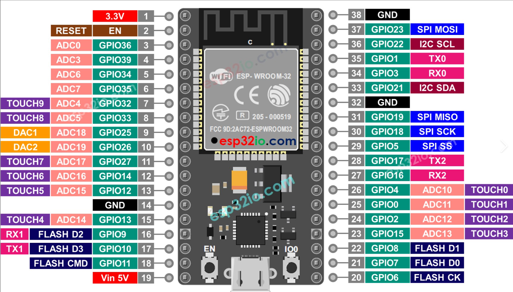

# Altimeter

## Contents

- [Summary](#summary)
- [Parts list](#parts-list)
  - [Core components](#core-components)
  - [Other parts](#other-parts)
  

## Summary
This github repository details the construction of a my second version digital skydiving altimeter. This one based on the ESP32-S3.

It is based on a pressure sensor board using the MS5637 chip and a 1.3" OLED SH1106 SPI driven screen. All is coordinated using an Arduino Pro Mini 5V 16Mhz microcontroller.  In addition it uses a circuit board based on the MCP73831 chip for charging the 3.7V LiPo battery and a battery level gauge circuit board using the MAX17048 chip. Voltage for the circuit is boosted from the LiPo to 5V by a Pololu U1V10F5 regulator board. There are no additional discrete components in this circuit apart from an on/off DPDT switch. Capactitors for current spikes have been considered but not implemented. 

The only interface elements are an on/off switch and a USB micro-B charging port. When first switched on the zeroed altitude is displayed in thousands of feet. A large font is used for digits above 99 feet. Eg. 13.532 indicates 13,532 feet above initial switching on altitude, with 13.5 displayed in a large font and 32 in small. Also a leading zero is dsiplayed for altitiudes inclusively between 100 and 999 feet. Eg 852 feet is displayed as 0.852 with 0.8 in large font and  52 in small.

In addition on the top line in a small font is displayed the temperature in Celsius on the pressure sensor board, the current voltage of the LiPo battery, its % remaining capacity and a graphic of the same. This also indicates if the battery is being charged. See third picture below.

It is too large to be practical. The Screen needs to have better visibility in sunlight. The on/off switch needs to be flush/membrane and have a Cypress method to avoid accidental switching off. Probably use a small ESP32C3 board with battery management next time. Smaller battery and 3D printed case. 

## Parts list
  
### Core components
Pricing and availability as of 1-Oct-2024

| Qty | Product | Description | AUD Cost | Comment | Designator |
| --- | --- | --- | --- | --- | --- |
| 1 | [XC3800](https://jaycar.com.au/p/XC3800) | Duinotech ESP32 Main Board with Wi-Fi and Bluetooth (ESP-WROOM-32)| $49.95 | The brains of the project with this [datasheet](Extra/XC3800_datasheetMain_87084.pdf) and  [pinout](Images/image_ESP32_board_pinout.png) |  |
| 1 | [BARO (52)](https://www.freetronics.com.au/products/barometric-pressure-sensor-module) | I2C 5V Barometric Pressure Sensor Module | $19.00 | based on the [MS5673 chip](Extra/ENG_DS_MS5637-02BA03_B5.pdf) |  |
| 1 | [XC4616](https://jaycar.com.au/p/XC4616) | Arduino Compatible 84x48 Dot Matrix LCD Display Module | $22.95 | The display used in this project with this [datasheet](Extra/XC4616_datasheetMain_73067.pdf) and [driver](Extra/PCD8544.pdf)|  |
| 1 | [S4724](https://www.altronics.com.au/p/s4724-3.7v-1100mah-polymer-lithium-ion-battery-lipo/) | 3.7V 1100mAh Polymer Lithium Ion Battery (LiPo) | $21.95 | The LiPo battery that powers this project | Connects to U4 using JST-PH connector |  |

### Other parts

| Qty | Product | Description | AUD Cost | Comment | Designator |
| --- | --- | --- | --- | --- | --- |
|1| [WW4030](https://jaycar.com.au/p/WW4030) | Tinned Copper Wire 22AWG - 100 gram Roll | $23.95 | for wiring up above Vero board | |
|1 | [HM3212](https://jaycar.com.au/p/HM3212) | 40 Pin Header Terminal Strip ( only need 4 pins ) | $1.45 | for soldering in sections to boards to attach to veroboard | |
|1 | [WH3004](https://jaycar.com.au/p/WH3004) | Yellow Light Duty Hook-up Wire - 25m (less than 30cm needed) | $7.95 | used for miscellaneous connections | |
|1 | [WH3007](https://jaycar.com.au/p/WH3007) | White Light Duty Hook-up Wire - 25m (less than 30cm needed) | $7.95 | used for miscellaneous connections | |
|1 | [HP0924](https://jaycar.com.au/p/HP0924) | M3 x 12mm Tapped Nylon Spacers - Pk.25 ( only need 4 x 3mm )| $11.95 | For mounting screen to Jiffy case | |
|1 | [HP0403](https://jaycar.com.au/p/HP0403) | M3 x 10mm Steel Screws - Pk.25 ( only need 4 )| $3.55 | For mounting screen to Jiffy case | |
|1 | [HP0425](https://jaycar.com.au/p/HP0425) | M3 Steel Nuts - Pk.25 ( only need 4 )| $3.70 | For mounting screen to Jiffy case | |
|1 | [HP0148](https://jaycar.com.au/p/HP0148) | 3mm Nylon Washers - Pk.10 ( only need 0 )| $2.95 | For mounting screen to Jiffy case | |